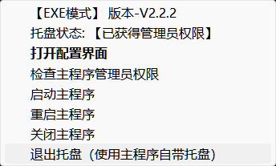

# 远程控制工具（RC-remote-controls）
简述：将电脑“模拟成”智能家居设备，通过 MQTT 实现开关控制、脚本执行、媒体/亮度/音量控制、按键模拟等。

声明：仅供学习交流，本人不对使用本程序产生的任何后果负责，请勿用于非法用途。

— 当前版本：2.2.1（Windows）

## 目录

- 概览与特性
- 组件结构
- 快速开始（首次使用）
- MQTT 配置（两种认证模式）
- 主题说明（内置 + 自定义）
- 托盘与权限
- 安装与打包
- 开机自启
- 常见问题（FAQ）
- 反馈

## 概览与特性

可接入：小爱同学、天猫精灵等，或通过 MQTT 接入 Home Assistant等自定义服务器。

核心特性（2.2.1）：

- 开关：重启/锁屏、执行命令、程序/脚本启停、服务启停（服务需管理员）
- 灯：调节亮度（0-100）
- 窗帘：调节系统音量（0-100）、媒体控制（上一曲/下一曲/播放暂停，支持百分比映射）
- 自定义主题：程序或脚本、服务、命令、按键(Hotkey)
  - 命令：PowerShell 执行；支持窗口显示/隐藏；关闭发送 CTRL_BREAK 优雅中断
  - 热键：组合键与 {down}/{up}；字母段逐字符发送，可设间隔；GUI 自带录制器
- 睡眠主题：sleep / hibernate / display_off / display_on / lock，支持 on/off 延时
- 脚本支持：.ps1 / .py(.pyw) / .cmd(.bat) / .exe；自动选择解释器；增强精确匹配与进程树终止
- MQTT：支持“私钥客户端ID（如巴法云）”与“用户名/密码”两种认证模式
- 托盘兜底：未启动独立托盘时，主程序自动启用内置托盘
- 管理员与自启：自动检测与提示提权；GUI 一键设置/移除开机自启
- 通知：Windows Toast 可开关

## 组件结构

- `main.py` / `RC-main.exe`：主程序（MQTT、主题执行、脚本/命令管理、托盘兜底、权限与自启）
- `GUI.py` / `RC-GUI.exe`：图形配置（MQTT、主题管理、热键录制、开机自启）
- `tray.py` / `RC-tray.exe`：托盘（显示模式/权限、启动/重启/关闭主程序）
- `config.json`：配置文件（首次运行 GUI 自动生成）
- `dome_config.json`：配置示例


## 快速开始（首次使用）

### 步骤 1：准备 MQTT（巴法云或其他平台）

修改你的巴法云订阅和密钥，并创建相应主题（记得修改主题昵称）。主题命名规则可参考巴法云接入文档（右上角智能音箱部分）：[接入文档](https://cloud.bemfa.com/docs/src/speaker_mi.html)

注：巴法云是免费的，请谨慎付费！

- 

提示：使用其他 MQTT 平台也可以，支持“私钥客户端ID”与“用户名/密码”两种认证模式；详见下文“MQTT 配置”。

### 步骤 2：配置并保存

- 运行 `RC-GUI.exe`
- 填写 MQTT（密钥/账号密码/服务器/端口），保存生成 `config.json`
- 在 GUI 中启用所需主题（test 模式可暂不启用）

- 

### 步骤 3：运行

- 直接运行托盘或主程序：`RC-tray.exe` 或 `RC-main.exe`
  - 托盘用于管理主程序（权限/启动/重启/关闭）；如未运行独立托盘，主程序会启用内置托盘

### 步骤 4：米家绑定（可选）

在米家绑定巴法云账号并同步设备后，可用小爱进行控制：

- 
- 

## MQTT 配置（两种认证模式）

支持：

- 私钥客户端ID：将私钥填入 `client_id`（适配巴法云等平台）
- 用户名/密码：填入 `mqtt_username` 与 `mqtt_password`，并将 `auth_mode` 设为 `username_password`

确保 `broker` 与 `port` 正确；认证失败会弹窗并停止重试，请修正配置后重启。

## 主题说明（内置 + 自定义）

内置：

- 电脑（开关）：on/off 动作可配置（lock/shutdown/restart/...），支持延时
- 屏幕（灯）：on=100，off=0，`on#数字` 设置亮度
- 音量（窗帘）：on=100，off=0，`on#数字` 设置音量；pause=静音
- 媒体（窗帘）：on=上一曲，off=下一曲，pause=播放/暂停；`on#百分比`：1-33 下一曲、34-66 播放/暂停、67-100 上一曲
- 睡眠（开关）：on/off 各自动作可选 sleep/hibernate/display_off/display_on/lock，并可设置延时

自定义：

- 程序或脚本：.ps1/.py/.pyw/.cmd/.bat/.exe（自动选择解释器/启动方式）
- 服务：填写服务名；需主程序为管理员权限
- 命令：PowerShell 执行；可选显示/隐藏窗口；关闭发送 CTRL_BREAK 优雅中断
- 按键(Hotkey)：组合键或字符序列；支持 {down}/{up}；字母段逐字符发送且可设间隔；GUI 提供“录制”

脚本管理：

- .ps1 使用 `powershell.exe -ExecutionPolicy Bypass -File`
- .py/.pyw 使用 `python.exe`
- .cmd/.bat 使用 `cmd /c`
- 终止优先精确匹配；.bat/.ps1 启用 wmic/psutil/taskkill 增强终止，并处理进程树

## 托盘与权限

托盘程序(`RC-tray.exe`)提供主程序管理（若未运行，主程序会启用内置托盘）：

1. **运行方式**：双击`RC-tray.exe`启动，推荐以管理员权限运行；单击托盘图标可直接打开配置界面
2. **功能菜单**： 
   
   - 显示当前运行模式(EXE/脚本)和权限状态
  - 打开配置界面：快速访问GUI配置工具（托盘图标单击同样触发）
  - 版本菜单：点击打开项目主页
  - 托盘状态：点击随机打开 res 下的彩蛋图片（cd1~cd5）
   - 检查主程序管理员权限：查看主程序是否具有管理员权限
   - 启动主程序：以管理员权限启动主程序
   - 重启主程序：重新启动主程序(先关闭后启动)
   - 关闭主程序：停止主程序运行
   - 退出托盘程序：关闭托盘但保留主程序运行
  主程序自带托盘
   


自动管理：托盘检测主程序状态；如独立托盘未运行，主程序会启用内置简洁托盘。


## 常见问题（FAQ）

- Q: 启动报错“应用程序已在运行”？
  A: 程序已启动，请检查是否有残留进程。
- Q: 配置文件不存在？
  A: 请先运行 GUI 程序，保存配置来保存配置。
- Q: 休眠/睡眠不可用？
  A: 请以管理员权限运行 cmd，并尝试执行
```bash
  powercfg /hibernate on
```
- Q: MQTT 无法连接？
  A: 检查服务器地址、端口、认证模式与凭据是否正确，网络是否畅通。
- Q: 托盘程序无法检测到主程序？
  A: 请尝试以管理员权限运行托盘程序，可能是权限问题导致。
- Q: 脚本无法启动？
  A: 检查脚本路径是否正确，以及是否有运行所需的权限。对于PowerShell脚本，确保执行策略允许脚本运行。
- Q: PowerShell脚本报错"不是有效的 Win32 应用程序"？
  A: 这通常是因为直接执行.ps1文件导致的，程序会自动使用powershell.exe来启动脚本。
- Q: 脚本终止时误关闭了其他程序？
  A: 程序已优化进程匹配逻辑，现在会精确识别和终止脚本相关进程，避免误终止用户程序。
- Q: 命令类型关闭怎么工作？
  A: 关闭时会向新控制台/进程组发送 CTRL_BREAK 优雅中断，失败再尝试终止。
- Q: 热键不生效或含中文？
  A: 请仅使用英数字/功能键；GUI 会提示包含中文的组合可能无法解析。
- Q: 依赖安装失败？
  A: 建议使用虚拟环境安装，确保Python版本为3.12.10及以上，使用requirements.txt安装全部依赖。
- Q: 打包后程序无法运行？
  A: 确保使用PyInstaller 6.13.0及以上版本，检查是否正确添加资源文件。

## 安装与打包

### 1. 环境要求

- **Python版本**: Python 3.12.10 及以上（推荐使用虚拟环境）
- **操作系统**: Windows 10/11（有跨平台计划，但暂无Mac支持）
- **系统组件**: PowerShell（用于.ps1脚本）、CMD（用于批处理脚本）

### 2. 依赖安装

**方式一：使用 requirements.txt（推荐）**
```bash
# 创建虚拟环境（推荐）
python -m venv .venv
.venv\Scripts\activate

# 安装依赖
pip install -r requirements.txt
```

**方式二：手动安装核心依赖**
```bash
pip install paho-mqtt>=2.1.0 wmi>=1.5.1 win11toast>=0.35 pillow>=11.2.0 pystray>=0.19.5 comtypes>=1.4.10 pycaw>=20240210 psutil>=7.0.0 pywin32>=310 pyautogui>=0.9.54
pip install --upgrade setuptools
```

**常见问题解决：**
- 如遇 tkinter 相关报错（如 init.tcl 找不到），请将 `tcl/tk` 文件夹复制到 Python 的 `Lib` 目录下
- 确保 PowerShell 执行策略允许脚本运行：`Set-ExecutionPolicy RemoteSigned`

### 3. 打包说明（PyInstaller ≥ 6.13.0）

如需打包为 exe：

```bash
# 安装打包工具
pip install pyinstaller>=6.13.0

# 打包GUI程序
pyinstaller -F -n RC-GUI --noconsole --icon=res\\icon_GUI.ico \
  --add-data "res\\icon_GUI.ico;res" --add-data "res\\top.ico;res" GUI.py

# 打包主程序
pyinstaller -F -n RC-main --windowed --icon=res\\icon.ico --add-data "res\\icon.ico;." main.py

# 打包托盘程序
pyinstaller -F -n RC-tray --windowed --icon=res\\icon.ico --add-data "res\\icon.ico;." tray.py
# 可选：如需将托盘彩蛋图片一起打包，请按实际扩展名添加（示例：cd1、cd2 为 .jpg）
# pyinstaller -F -n RC-tray --windowed --icon=res\\icon.ico \
#   --add-data "res\\cd1.jpg;res" --add-data "res\\cd2.jpg;res" \
#   --add-data "res\\cd3.jpg;res" --add-data "res\\cd4.jpg;res" --add-data "res\\cd5.png;res" \
#   --add-data "res\\icon.ico;." tray.py
```

提示：打包后首次运行 GUI 以生成/更新 `config.json`；如设置了计划任务自启，移动文件位置后需重新设置任务。

### 4. 开机自启（可选）

在 GUI 中可一键创建/移除计划任务：

- 方案一：用户登录时运行（使用 Administrators 组，推荐“无托盘”场景）
- 方案二：系统启动时运行（使用 SYSTEM；托盘可在登录后启动并重启主程序以获得媒体控制）

## 反馈与交流

如有问题、建议或 Bug 反馈，请通过 GitHub Issue 或邮箱（mc_chen6019@qq.com）联系作者。

---
