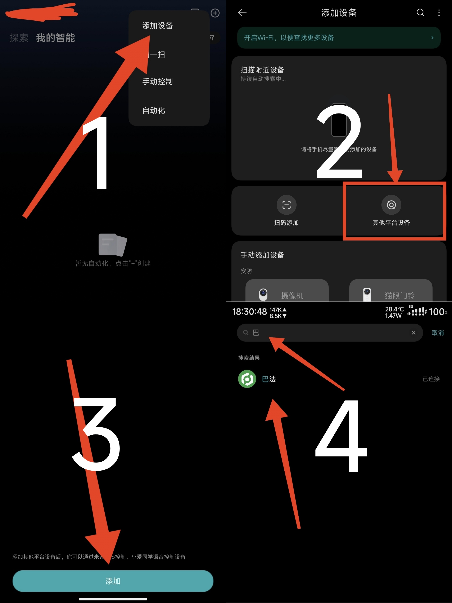

# 远程控制工具（RC-remote-controls）
## 并非传统意义上的远程控制，是将电脑模拟成智能家居，通过mqtt实现远程开关，执行脚本等功能！！
#### 免责声明：本项目仅供学习交流使用，本人不对使用本程序产生的任何后果负责，请勿用于非法用途，否则后果自负

## 项目简介

本项目旨在通过小爱同学、天猫精灵等智能音箱，实现对 Windows 电脑的远程控制，包括关机、锁定、启动应用/脚本、服务管理、调节显示器亮度、音量等功能。支持自定义主题，适合有远程自动化需求的用户。

## 功能

- （设备类型开关）远程重启、锁定、启动应用程序或脚本、服务启停
- （设备类型灯）调节显示器亮度
- （设备类型灯）调节系统音量
- （设备类型窗帘）媒体控制（播放/暂停、上一曲/下一曲）
- 支持多种脚本类型：PowerShell (.ps1)、Python (.py/.pyw)、批处理 (.cmd/.bat)
- 智能脚本启动和终止：根据脚本类型自动选择合适的解释器
- 精确进程管理：避免误终止用户进程，支持脚本进程的精确识别和终止
- 支持自定义主题（程序/脚本/服务）
- 支持开机自启、管理员权限检测和自动提权
- 支持 test 模式（测试/调试用）

## 环境依赖与安装

### 1. 环境要求

- **Python版本**: Python 3.12.10 及以上（推荐使用虚拟环境）
- **操作系统**: Windows 10/11（有跨平台计划，但暂无Mac支持）
- **系统组件**: PowerShell（用于.ps1脚本）、CMD（用于批处理脚本）

### 2. 依赖安装

**方式一：使用requirements.txt（推荐）**
```bash
# 创建虚拟环境（推荐）
python -m venv .venv
.venv\Scripts\activate

# 安装依赖
pip install -r requirements.txt
```

**方式二：手动安装核心依赖**
```bash
pip install paho-mqtt>=2.1.0 wmi>=1.5.1 win11toast>=0.35 pillow>=11.2.0 pystray>=0.19.5 comtypes>=1.4.10 pycaw>=20240210 psutil>=7.0.0 pywin32>=310 pyautogui>=0.9.54
pip install --upgrade setuptools
```

**常见问题解决：**
- 如遇 tkinter 相关报错（如 init.tcl 找不到），请将 `tcl/tk` 文件夹复制到 Python 的 `Lib` 目录下
- 确保 PowerShell 执行策略允许脚本运行：`Set-ExecutionPolicy RemoteSigned`

### 3. 打包说明

如需打包为exe，使用PyInstaller 6.13.0及以上版本：

```bash
# 安装打包工具
pip install pyinstaller>=6.13.0

# 打包GUI程序
pyinstaller -F -n RC-GUI --noconsole --icon=res\\icon_GUI.ico GUI.py

# 打包主程序
pyinstaller -F -n RC-main --windowed --icon=res\\icon.ico --add-data "res\\icon.ico;." main.py

# 打包托盘程序
pyinstaller -F -n RC-tray --windowed --icon=res\\icon.ico --add-data "res\\icon.ico;." tray.py
```

## 教程（参考）

### 1. 修改 MQTT 服务器信息

修改你的巴法云订阅和密钥，并创建相应主题（记得修改主题昵称） 具体主题命名规则可以看巴法云接入文档（右上角里面智能音箱部分）[接入文档](https://cloud.bemfa.com/docs/src/speaker_mi.html)  
例如：（记得复制密钥备用）

- 

### 2. 启动程序

可以直接下载执行文件，也可以下载源码自行编译：  
- `RC-GUI.exe`：配置界面程序
- `RC-main.exe`：主程序，负责MQTT连接和控制功能
- `RC-tray.exe`：托盘程序，用于管理和监控主程序

打开 GUI 程序，输入巴法云密钥等信息，点击保存。
例：（可分别启用主题（test 模式可不启用主题））

- 

### 3. 米家绑定巴法云账号

绑定后同步设备，小爱就能控制了

- 
- 

## 项目文件说明

本项目由以下主要组件构成：

- `main.py` / `RC-main.exe`：主程序，负责MQTT连接和执行控制命令，支持多种脚本类型的智能启动和终止
- `GUI.py` / `RC-GUI.exe`：配置界面，用于设置MQTT参数和自定义主题
- `tray.py` / `RC-tray.exe`：系统托盘程序，用于监控和管理主程序
- `config.json`：配置文件，存储MQTT连接信息和自定义主题设置
- `dome_config.json`：示例配置文件，提供配置参考模板

## 脚本支持说明

程序现已支持多种脚本类型的智能启动和终止：

### 支持的脚本类型
- **PowerShell脚本 (.ps1)**：自动使用 `powershell.exe -ExecutionPolicy Bypass -File` 启动
- **Python脚本 (.py/.pyw)**：自动使用 `python.exe` 启动
- **批处理脚本 (.cmd/.bat)**：使用 `cmd /c` 启动
- **可执行文件 (.exe)**：直接启动

### 智能进程管理
- **精确识别**：通过命令行参数精确匹配脚本进程，避免误终止
- **多重终止方法**：支持 wmic、psutil、taskkill 等多种方式确保可靠终止
- **进程树处理**：自动处理子进程，确保完整清理

### 使用建议
- PowerShell脚本建议设置合适的执行策略
- Python脚本确保Python环境已正确配置
- 批处理脚本注意路径中的空格和特殊字符
- 所有脚本都支持相对路径和绝对路径

## 托盘程序使用说明

托盘程序(`RC-tray.exe`)提供了便捷的主程序管理功能：

1. **运行方式**：双击`RC-tray.exe`启动，推荐以管理员权限运行
2. **功能菜单**： 
   
   - 显示当前运行模式(EXE/脚本)和权限状态
   - 打开配置界面：快速访问GUI配置工具
   - 检查主程序管理员权限：查看主程序是否具有管理员权限
   - 启动主程序：以管理员权限启动主程序
   - 重启主程序：重新启动主程序(先关闭后启动)
   - 关闭主程序：停止主程序运行
   - 退出托盘程序：关闭托盘但保留主程序运行
  主程序自带托盘
   


1. **自动管理**：托盘程序会自动检测主程序是否运行，如未运行则自动启动

## 常见问题（FAQ）

- Q: 启动报错“应用程序已在运行”？
  A: 程序已启动，请检查是否有残留进程。
- Q: 配置文件不存在？
  A: 请先运行 GUI 程序，保存配置来保存配置。
- Q: 休眠/睡眠不可用？
  A: 请以管理员权限运行 cmd，并尝试执行
```bash
  powercfg /hibernate on
```
- Q: MQTT 无法连接？
  A: 检查服务器地址、端口、密钥是否正确，网络是否畅通。
- Q: 托盘程序无法检测到主程序？
  A: 请尝试以管理员权限运行托盘程序，可能是权限问题导致。
- Q: 脚本无法启动？
  A: 检查脚本路径是否正确，以及是否有运行所需的权限。对于PowerShell脚本，确保执行策略允许脚本运行。
- Q: PowerShell脚本报错"不是有效的 Win32 应用程序"？
  A: 这通常是因为直接执行.ps1文件导致的，程序会自动使用powershell.exe来启动脚本。
- Q: 脚本终止时误关闭了其他程序？
  A: 程序已优化进程匹配逻辑，现在会精确识别和终止脚本相关进程，避免误终止用户程序。
- Q: 依赖安装失败？
  A: 建议使用虚拟环境安装，确保Python版本为3.12.10及以上，使用requirements.txt安装全部依赖。
- Q: 打包后程序无法运行？
  A: 确保使用PyInstaller 6.13.0及以上版本，检查是否正确添加资源文件。


## 更新日志

### v2.1.2 (2025-07-11)
- 🔧 修复批处理脚本启动问题，改用cmd /c方式启动
- 🚀 新增PowerShell脚本(.ps1)完整支持，自动使用powershell.exe启动
- 🐍 新增Python脚本(.py/.pyw)完整支持，自动使用python.exe启动
- 🎯 大幅改进脚本进程终止精确度，避免误终止用户进程
- 📺 新增媒体控制功能（设备类型：窗帘），支持播放/暂停、切换曲目
- 🔍 增强进程管理：支持wmic、psutil、taskkill多种方式精确终止脚本进程
- 🛡️ 优化管理员权限检测和自动提权机制
- 📝 完善日志记录，便于问题排查和调试

### v2.0.0 (2025-05-12)
- 添加托盘程序功能，方便监控和管理主程序
- 改进管理员权限检测机制
- 优化进程管理和启动流程
- 修复已知问题和稳定性改进

### v1.0.0
- 初始版本发布
- 基本的MQTT远程控制功能
- GUI配置界面
- 自定义主题支持

## 反馈与交流

如有问题、建议或 Bug 反馈，请通过 GitHub Issue 或邮箱（mc_chen6019@qq.com）联系作者。

---
