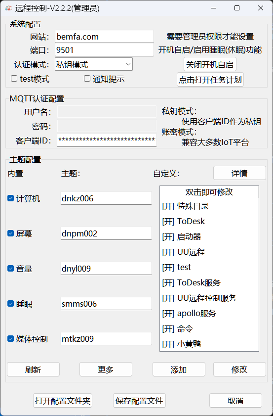

<!-- @format -->

# 详细使用说明

## 目录

- 概览与特性
- 组件结构
- 快速开始（首次使用）
- MQTT 配置（两种认证模式）
- 配置文件字段说明（config.json）
- 主题说明（内置 + 自定义）
- 托盘与权限
- 安装与打包
- 开机自启
- 常见问题（FAQ）
- 反馈

## 概览与特性

可接入：小爱同学、天猫精灵等，或通过 MQTT 接入 Home Assistant等自定义服务器。

核心特性（版本号以 `src/python/version_info.py` / `version.txt` 为准）：

基础能力：

- 开关：重启/锁屏、执行命令、程序/脚本启停、服务启停（服务需管理员）
- 灯：调节亮度（0-100）
- 窗帘：调节系统音量（0-100）、媒体控制（上一曲/下一曲/播放暂停，支持百分比映射）
- 自定义主题：程序或脚本、服务、命令、按键(Hotkey)
  - 命令：PowerShell 执行；支持窗口显示/隐藏；关闭发送 CTRL_BREAK 优雅中断
  - 热键：组合键与 {down}/{up}；字母段逐字符发送，可设间隔；GUI 自带录制器
- 睡眠主题：sleep / hibernate / display_off / display_on / lock，支持 on/off 延时
- 脚本支持：.ps1 / .py(.pyw) / .cmd(.bat) / .exe；自动选择解释器；增强精确匹配与进程树终止
- MQTT：支持“私钥客户端ID（如巴法云）”与“用户名/密码”两种认证模式
- 托盘兜底：未启动独立托盘时，主程序自动启用内置托盘
- 管理员与自启：自动检测与提示提权；GUI 一键设置/移除开机自启
- 通知：Windows Toast 可开关

近期新增 / 强化（示例项，随版本迭代可能变化）：

- 动态版本管理：移除源码硬编码版本，集中于 `src/python/version_info.py`，打包与安装器脚本自动注入
- GitHub Actions：标签触发自动构建与发布；重复同版本构建自动合并更新日志
- 启动日志增强：主程序详细记录版本/运行模式/系统环境，便于排障
- 托盘版本菜单：点击后异步检查最新版本，菜单文本实时更新“检查中/新版本/已最新/失败”状态并使用缓存避免重复请求
- 安装器改进：Inno Setup 动态生成临时脚本注入版本；修复误报“程序正在运行”的进程检测逻辑
- 更健壮的未知版本处理：本地版本缺失时显示“V未知版本”并始终提示可更新
- 构建清洁性：打包过程不修改源文件，临时文件自动清理

补充说明：屏幕亮度支持系统接口与 Twinkle Tray 两种方案（可在 GUI 中切换）；托盘“彩蛋/随机图片”已改为访问远程随机接口，不再依赖本地打包 cd1~cd5 图片。

## 组件结构

- `src/main/*.c` / `RC-main.exe`：主程序（MQTT、主题执行、脚本/命令管理、托盘兜底、权限与自启）
- `src/python/GUI.py` / `RC-GUI.exe`：图形配置（MQTT、主题管理、热键录制、开机自启）
- `src/tray/*.c` / `RC-tray.exe`：托盘（显示模式/权限、启动/重启/关闭主程序）
- `config.json`：配置文件（首次运行 GUI 自动生成）
- `dome_config.json`：配置示例

## 快速开始（首次使用）

### 步骤 1：准备 MQTT（巴法云或其他平台）

修改你的巴法云订阅和密钥，并创建相应主题（记得修改主题昵称）。主题命名规则可参考巴法云接入文档（右上角智能音箱部分）：[接入文档](https://cloud.bemfa.com/docs/src/speaker_mi.html)

注：巴法云是免费的，请谨慎付费！

- 

提示：使用其他 MQTT 平台也可以，支持“私钥客户端ID”与“用户名/密码”两种认证模式；详见下文“MQTT 配置”。

### 步骤 2：配置并保存

- 运行 `RC-GUI.exe`
- 填写 MQTT（密钥/账号密码/服务器/端口），保存生成 `config.json`
- 在 GUI 中启用所需主题（test 模式可暂不启用）

- 

### 步骤 3：运行

- 直接运行托盘或主程序：`RC-tray.exe` 或 `RC-main.exe`
  - 托盘用于管理主程序（权限/启动/重启/关闭）；如未运行独立托盘，主程序会启用内置托盘

### 步骤 4：米家绑定（可选）

在米家绑定巴法云账号并同步设备后，可用小爱进行控制：

- 
- 

## MQTT 配置（两种认证模式）

支持：

- 私钥客户端ID：将私钥填入 `client_id`（适配巴法云等平台）
- 用户名/密码：填入 `mqtt_username` 与 `mqtt_password`，并将 `auth_mode` 设为 `username_password`

确保 `broker` 与 `port` 正确；认证失败会弹窗并停止重试，请修正配置后重启。

补充：主程序默认使用 TCP 连接（形如 `tcp://broker:port`），TLS（SSL）默认关闭。

如需启用 TLS：

- `mqtt_tls`: 1（启用 `ssl://broker:port`）
- `mqtt_tls_verify`: 0/1（是否校验证书；默认 0）
- `mqtt_tls_ca_file`: CA 证书文件路径（建议绝对路径；相对路径以程序目录为基准）

注意：启用 TLS 需要构建时链接 Paho SSL 库（如 `paho-mqtt3cs`）。

## 配置文件字段说明（config.json）

`config.json` 默认位于程序同目录（首次保存配置时由 GUI 自动生成）。建议优先使用 GUI 修改配置，手动编辑后重启程序生效。

### MQTT 与基础字段

- `broker` / `port`：MQTT 服务器与端口（示例：`bemfa.com:9501`）
- `auth_mode`：认证模式
  - `private_key`：私钥模式（把私钥填到 `client_id`）
  - `username_password`：账号密码模式（填写 `mqtt_username` / `mqtt_password`）
- `client_id`：MQTT Client ID（私钥模式下即“私钥”）
- `mqtt_username` / `mqtt_password`：账号密码模式的用户名与密码
- `mqtt_tls`：是否启用 TLS/SSL（0/1；启用后使用 `ssl://`）
- `mqtt_tls_verify`：是否校验服务器证书（0/1；启用后建议配置 CA 文件）
- `mqtt_tls_ca_file`：CA 证书文件路径（PEM/CRT），用于证书校验
- `test`：测试模式（一般用于调试；为 1 时可不启用主题也运行）
- `language`：界面语言（`zh` / `en`）
- `notify`：通知开关（0/1）

### 内置主题（Topic 与开关）

每个主题对应一组 Topic（如 `Computer`、`screen`、`volume`、`media`、`sleep`），并有一个 `_checked` 开关控制是否启用订阅：

- `Computer` / `Computer_checked`
- `screen` / `screen_checked`
- `volume` / `volume_checked`
- `media` / `media_checked`
- `sleep` / `sleep_checked`

内置主题的 on/off 动作（以“电脑/睡眠”为例）：

- `computer_on_action` / `computer_off_action`：如 `lock` / `shutdown` / `restart`
- `computer_on_delay` / `computer_off_delay`：延时秒数
- `sleep_on_action` / `sleep_off_action`：如 `sleep` / `hibernate` / `display_off` / `display_on` / `lock` / `none`
- `sleep_on_delay` / `sleep_off_delay`：延时秒数

### 亮度控制（Twinkle Tray 可选）

- `brightness_mode`：亮度控制方案
  - `wmi`：系统接口（默认显示器场景更稳）
  - `twinkle_tray`：Twinkle Tray 命令行（外接显示器更友好）
- `twinkle_tray_path`：Twinkle Tray 可执行文件路径（可包含引号）
- `twinkle_tray_target_mode`：目标模式（如 `all`）
- `twinkle_tray_target_value`：目标值（显示器编号/ID 等，取决于模式）
- `twinkle_tray_overlay`：是否显示 Overlay（0/1）

### 自定义主题（字段命名规则）

自定义主题以 N 递增分组（从 1 开始），常见类型：

- 程序/脚本：`applicationN*`
  - `applicationN`：该主题 Topic
  - `applicationN_name`：显示名称
  - `applicationN_checked`：是否启用
  - `applicationN_on_value` / `applicationN_off_value`：on/off 的命令或路径
  - `applicationN_off_preset`：关闭预设（如 `kill`/`ignore`/`custom`）
  - `applicationN_directoryN`：GUI 选择文件时写入的路径缓存（用于回显）

- 服务：`serveN*`（需要管理员权限）
  - `serveN_value` / `serveN_on_value`：服务名
  - `serveN_off_preset`：如 `stop`

- 命令：`commandN*`
  - `commandN_on_value` / `commandN_off_value`：命令内容（支持 `{value}` 占位符）
  - `commandN_off_preset`：关闭预设
  - `commandN_window`：窗口显示模式（如 `show`）
  - `commandN_value_min` / `commandN_value_max`：参数范围（用于 `on#数字` / `off#数字`）

- 热键：`hotkeyN*`
  - `hotkeyN_on_type` / `hotkeyN_off_type`：如 `keyboard` / `none`
  - `hotkeyN_on_value` / `hotkeyN_off_value`：如 `ctrl+alt+s`
  - `hotkeyN_char_delay_ms`：字符间隔（逐字符发送时）

## 主题说明（内置 + 自定义）

内置：

- 电脑（开关）：on/off 动作可配置（lock/shutdown/restart/...），支持延时
- 屏幕（灯）：on=100，off=0，`on#数字` 设置亮度
- 音量（窗帘）：on=100，off=0，`on#数字` 设置音量；pause=静音
- 媒体（窗帘）：on=上一曲，off=下一曲，pause=播放/暂停；`on#百分比`：1-33 下一曲、34-66 播放/暂停、67-100 上一曲
- 睡眠（开关）：on/off 各自动作可选 sleep/hibernate/display_off/display_on/lock，并可设置延时

自定义：

- 程序或脚本：.ps1/.py/.pyw/.cmd/.bat/.exe（自动选择解释器/启动方式）
- 服务：填写服务名；需主程序为管理员权限
- 命令：PowerShell 执行；可选显示/隐藏窗口；关闭发送 CTRL_BREAK 优雅中断
- 按键(Hotkey)：组合键或字符序列；支持 {down}/{up}；字母段逐字符发送且可设间隔；GUI 提供“录制”

脚本管理：

- .ps1 使用 `powershell.exe -ExecutionPolicy Bypass -File`
- .py/.pyw 使用 `python.exe`
- .cmd/.bat 使用 `cmd /c`
- 终止优先精确匹配；.bat/.ps1 启用 wmic/psutil/taskkill 增强终止，并处理进程树

## 托盘与权限

托盘程序(`RC-tray.exe`)提供主程序管理（若未运行，主程序会启用内置托盘）：

1. **运行方式**：双击`RC-tray.exe`启动，推荐以管理员权限运行；单击托盘图标可直接打开配置界面
2. **功能菜单**：
   
   - 显示当前运行模式(EXE/脚本)和权限状态

- 打开配置界面：快速访问GUI配置工具（托盘图标单击同样触发）
- 版本菜单：点击打开项目主页
- 托盘状态：点击会触发随机彩蛋（通过远程随机图片接口），避免因本地资源缺失导致 404/打开失败
- 检查主程序管理员权限：查看主程序是否具有管理员权限
- 启动主程序：以管理员权限启动主程序
- 重启主程序：重新启动主程序(先关闭后启动)
- 关闭主程序：停止主程序运行
- 退出托盘程序：关闭托盘但保留主程序运行
  主程序自带托盘
   

自动管理：托盘检测主程序状态；如独立托盘未运行，主程序会启用内置简洁托盘。

## 安装与打包

### 直接使用（推荐）

1. 到 Release 下载：
  - `Remote-Controls-Installer-*.exe`（安装包）
  - 或单文件：`RC-main.exe` / `RC-tray.exe` / `RC-GUI.exe`
2. 先运行 `RC-GUI.exe` 保存配置，再运行 `RC-tray.exe`（推荐）。

### 本地构建（开发/自行打包）

构建依赖：

- Windows 10/11
- Python 3.12.x（用于 GUI + PyInstaller）
- MSYS2 + MinGW64（用于 C 主程序/托盘；需要 `gcc`、`windres` 在 PATH）
- Inno Setup 6（用于生成安装包，默认路径 `C:\Program Files (x86)\Inno Setup 6\iscc.exe`）

推荐命令（PowerShell）：

```powershell
python -m venv .venv
.\.venv\Scripts\Activate.ps1
pip install -r requirements.txt

# 交互式（会提示输入版本号）
.\build.ps1

# 无交互（适合 CI/无人值守）
.\build.ps1 3.0.0 -NoPause
```

产物位置：

- `installer/dist/RC-*.exe`
- `installer/dist/installer/Remote-Controls-Installer-*.exe`
- 详细构建日志：`logs/*.log`

## 开机自启

GUI 提供一键设置/移除开机自启（本质是创建/删除计划任务）：

- 主程序任务名：`Remote Controls Main Service`
- 托盘任务名：`Remote Controls Tray`

设置时会让你选择两种方案：

- 方案一（ONLOGON）：用户登录时启动主程序（适合“只要登录后才需要运行”的场景）
- 方案二（ONSTART）：系统启动时以 SYSTEM 启动主程序（适合需要尽早启动的场景；媒体控制可能需登录后托盘重启主程序才能完整生效）

提示：移动 EXE 文件位置后，需要重新设置任务（任务里记录的是旧路径）。

## 常见问题（FAQ）

### 1) MQTT 连接不上 / 频繁重连

- 先确认 `broker`/`port` 可达，认证模式与字段匹配（私钥 vs 用户名密码）。
- 如果服务端只提供 TLS(8883)：当前默认构建使用 TCP，不支持 TLS。
- 认证失败属于“不可恢复错误”，程序会提示并停止重试；修正配置后重启。

### 2) 休眠/休眠(hibernate) 不可用

以管理员打开终端执行：

```powershell
powercfg /hibernate on
```

### 3) 服务主题无法启动/停止

服务控制需要管理员权限：请用管理员运行托盘/主程序，或用 GUI 设置为最高权限自启。

### 4) PowerShell 脚本无法执行

建议设置执行策略（按需选择范围）：

```powershell
Set-ExecutionPolicy RemoteSigned
```

### 5) 找不到配置/日志

- 配置：默认在程序同目录的 `config.json`
- 构建日志：`logs/*.log`

## 反馈

- Issue：请提供复现步骤、运行方式（安装包/单文件/源码）、以及 `logs` 相关日志片段。
- 邮件：`mc_chen6019@qq.com`
